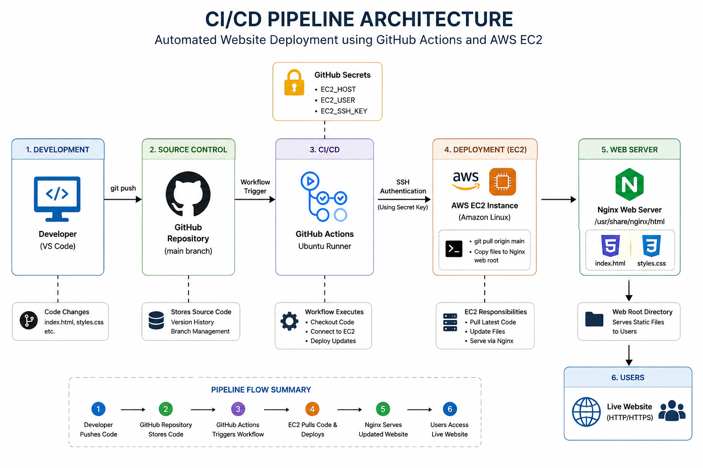
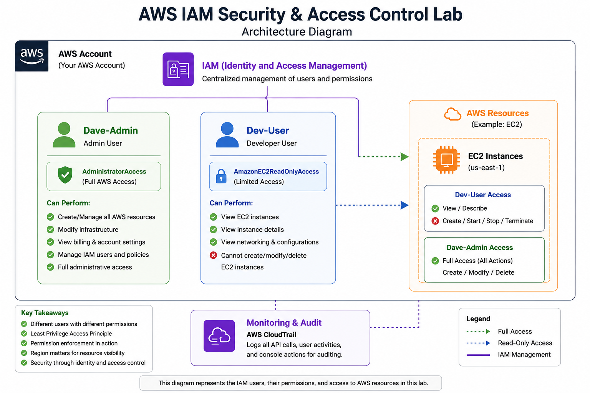
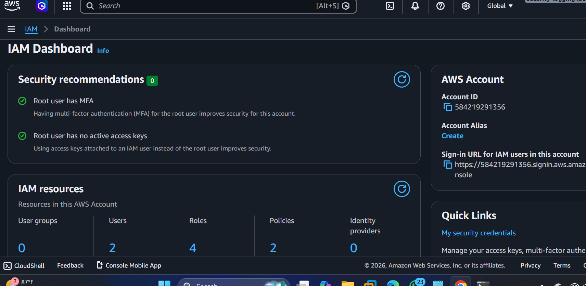
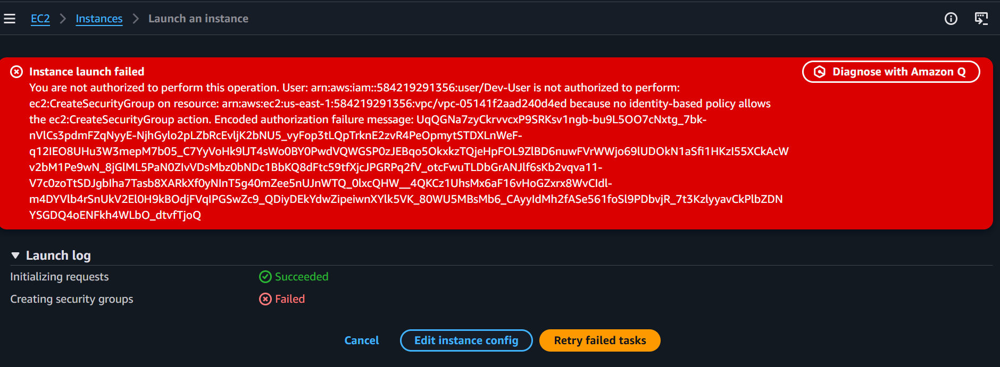

Project 1: Initial Website Deployment Using SCP

Situation

A static website needed to be deployed to a cloud-hosted web server on AWS. At this stage, there was no source control or automated deployment process in place, and website files existed only on the local machine.

Task

Deploy the website to an AWS EC2 instance running Amazon Linux and make it accessible to users over the internet using Nginx as the web server.

Action

Provisioned an Amazon Linux EC2 instance in AWS.

Configured Security Groups to allow SSH (Port 22) and HTTP (Port 80) traffic.

Installed and configured the Nginx web server.

Created website files locally using VS Code.

Used SCP (Secure Copy Protocol) over SSH to transfer website files from the local machine to the EC2 instance.

Moved website files into Nginx's document root (/usr/share/nginx/html).

Verified web server functionality and browser accessibility using the EC2 public IP address.

Result

Successfully hosted a static website on AWS EC2.

Established a secure file transfer process using SCP and SSH.

Enabled internet-based access to the website through Nginx.

Gained practical experience with Linux administration, SSH, Nginx configuration, and AWS networking.

Project 2: GitHub-Based Website Deployment Architecture

Situation

While the SCP deployment method successfully hosted the website, every update required manually copying files from the local machine to the server. This process was time-consuming, difficult to track, and lacked version control.

Task

Improve the deployment workflow by introducing source control and centralized code management while maintaining secure administration and website availability.

Action

Created and configured a GitHub repository to store website source code.

Initialized Git version control locally using VS Code and Git.

Implemented a Git-based workflow using commits and pushes to GitHub.

Cloned the repository onto the EC2 instance.

Used Git pull operations to retrieve updates from GitHub to the server.

Continued managing the EC2 instance through SSH.

Configured Nginx to serve website content from the deployment directory.

Maintained HTTP access for end users through Port 80.

Result

Eliminated the need to manually transfer files using SCP for every update.

Established a centralized source-of-truth repository for website code.

Improved deployment consistency and version tracking.

Enabled easier collaboration and rollback capabilities through Git history.

Built a foundation for future CI/CD automation using GitHub Actions.

Third Deployment with Docker
Project 2: AWS EC2 + Docker + Nginx Website Deployment

Situation

A static website needed to be hosted in a reliable and portable environment rather than running directly on a local machine. 

The goal was to deploy the application on AWS while leveraging containerization to create a consistent deployment environment and improve maintainability.

Task

Design and deploy a cloud-based hosting solution that would:

Host a static website on AWS EC2.

Use Docker for application containerization.

Serve website content through Nginx.

Store source code in GitHub for version control.

Allow secure remote administration through SSH.

Action

Provisioned and configured an AWS EC2 instance running Amazon Linux.

Installed and configured Docker Engine on the EC2 server.

Pulled and managed a Dockerized Nginx web server container.

Configured Docker volume mounting to map the host directory (/usr/share/nginx/html) to the Nginx container for persistent website content.

Stored website source code in a GitHub repository and used Git workflows for version control.

Configured Security Groups to allow HTTP (Port 80) and SSH (Port 22) access.

Performed Linux administration and troubleshooting using SSH for deployment and maintenance activities.

Verified end-user accessibility through browser-based testing.

Result

Successfully deployed a containerized static website on AWS EC2.

Achieved separation between the web server runtime and website content using Docker volume mounts.

Established a repeatable deployment workflow using GitHub as the source repository.

Improved application portability by running the website within a Docker container rather than directly on the host operating system.

Created a foundation for future automation, CI/CD integration, monitoring, and infrastructure scaling initiatives.

CI/CD Pipeline Deployment

Situation: 

A static website needed a reliable, automated deployment process to eliminate manual file transfers and reduce the risk of human error during updates.

Task:

Design and implement a CI/CD pipeline that automatically deploys code changes from a local development environment to a live web server hosted on AWS EC2.

Action:
Built an end-to-end automated pipeline using GitHub Actions as the orchestration layer. Code changes authored in VS Code are pushed to a GitHub repository (main branch), which triggers a GitHub Actions workflow on an Ubuntu runner. The workflow authenticates to an AWS EC2 instance (Amazon Linux) via SSH using secrets stored securely in GitHub (EC2_HOST, EC2_USER, EC2_SSH_KEY), then pulls the latest code and copies updated files to the Nginx web root at /usr/share/nginx/html.

Result:

Every git push to main now automatically provisions a live update to the production website served by Nginx over HTTP/HTTPS, giving end users immediate access to the latest version with zero manual intervention.

EC2 Instance

Nginx Status

 Live Website
 

 EC2 Instance
 

Github Repo

SSH Login Successful

inbound traffic allowed

Inbound traffic rule allowed here, makes it possible for the web page to display and be reachable.

inbound traffic Denied

Inbound traffic rule in deny state, stops the web page from being reachable.

page live inbound allow

This web page is live in this image because NACL inbound rule is allowed.

page unreachable inbound deny

This web page is unreachable due to NACL inbound rule in a deny state.

Instance Monitoring

Documentation
Projects

Detailed project documentation available in:

projects/aws-ec2-nginx-project.md
Technical Notes

Operational and troubleshooting notes available in:

notes/linux-commands.md

notes/nginx-notes.md

notes/ssh-troubleshooting.md

notes/aws-security-groups.md

notes/git-github-notes.md

notes/deployment-workflow.md

AWS IAM Security & Access Control Lab

Project Overview

Built a practical AWS IAM security lab to understand identity management, access control, and least privilege principles in AWS cloud environments.

This project focused on:

1. IAM user management
2. permission enforcement
3. security best practices
4. AWS account governance
5. access troubleshooting

   
   Technologies Used
   
1. AWS IAM
2. AWS EC2
3. AWS Management Console
4. Git & GitHub

   
Key Features

1. Created multiple IAM users with different permission levels

2. Configured AWS Management Console access

3. Implemented least privilege access control

4. Tested IAM permission enforcement

5. Performed region-based troubleshooting

6. Demonstrated role separation and security boundaries

   

IAM Users Created

User	          Access Level	              Purpose
Dave-Admin	   AdministratorAccess	        Full AWS administration

Dev-User	     AmazonEC2ReadOnlyAccess	     Read-only infrastructure access

Security Concepts Demonstrated

1. Identity & Access Management (IAM)
2. Least Privilege Principle
3. Role-Based Access Control (RBAC)
3. Permission Enforcement
4. AWS Region Awareness
5. Cloud Security Fundamentals
6. Access Troubleshooting

Permission Testing

The developer account was tested against restricted EC2 actions.

Successful Actions

1. View EC2 instances
2. Inspect infrastructure resources
   
Blocked Actions

1. Launch EC2 instances
2. Modify infrastructure
3. Terminate EC2 instances

This verified correct IAM policy enforcement.

Troubleshooting Experience

Region Mismatch Issue

Problem.

EC2 instances were not visible after login.

Cause.

Incorrect AWS region selected.

Resolution.

Switched to the correct deployment region where the EC2 instance existed.

Architecture Diagram

Project Screenshots

IAM DASHBOARD

Dev-user Permission Denied

Skills Demonstrated

1. AWS IAM Administration
2. Cloud Security Fundamentals
3. User Access Management
4. IAM Policy Assignment
5. AWS Troubleshooting
6. Infrastructure Visibility Control
7. Security Governance Concepts

Future Improvements

- Provision EC2, Security Groups, and networking resources using Terraform
- Automate Nginx and Docker configuration using Ansible
- Implement CloudWatch monitoring and alerting
- Deploy behind an Application Load Balancer (ALB)
- Configure Auto Scaling Groups for high availability
- Store and deploy container images from Amazon ECR and more

