This repository contains my hands-on cloud engineering projects, deployment workflows, troubleshooting notes, architecture diagrams, and infrastructure documentation.

The portfolio focuses on practical experience with:
  AWS EC2
  Linux administration
  Nginx web hosting
  Git and GitHub workflows
  SSH remote administration
  Cloud networking fundamentals
  Deployment troubleshooting

Portfolio Structure
Cloud-Engineering-Portfolio
diagrams
notes
projects
resume
screenshots

Featured Project
AWS EC2 Nginx Website Deployment

Built and deployed a static landing page on AWS EC2 using Linux and Nginx.

Skills Demonstrated
AWS EC2 administration
Linux command-line operations
Nginx configuration
SSH remote administration
GitHub deployment workflow
Security Group configuration
Troubleshooting and debugging
Deployment Architecture

Deployment Workflow
VS Code
↓
GitHub
↓
AWS EC2
↓
Nginx
↓
Live Website

Screenshots

First Deployment with SCP Without Git and Github.

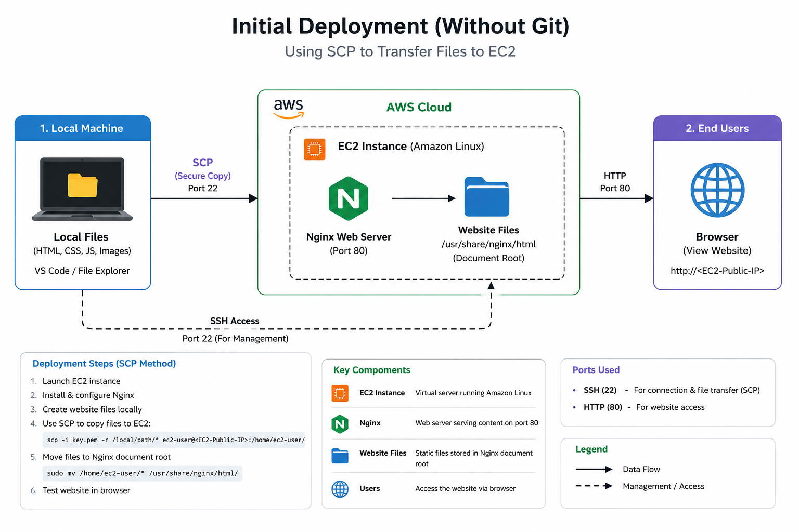

Second Deployment with Git and Github

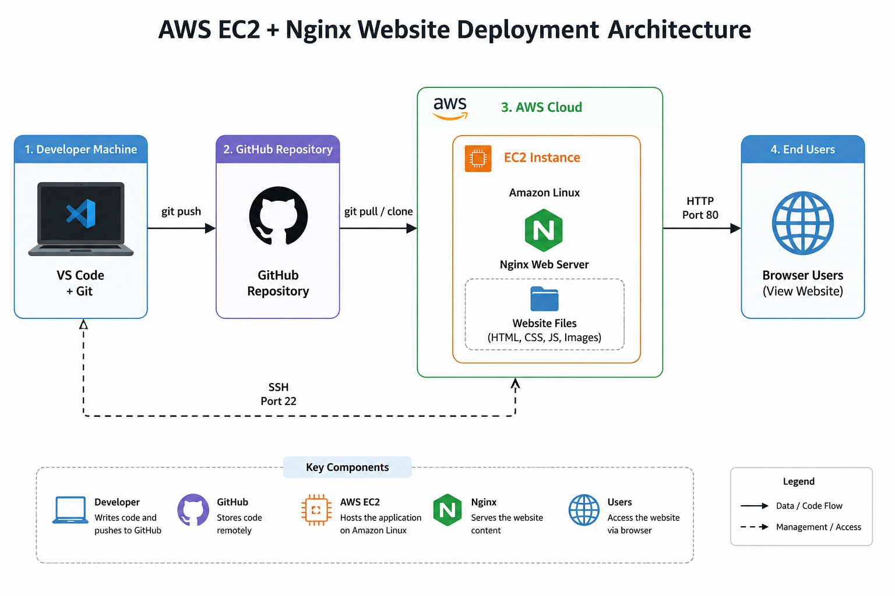

Third Deployment with Docker

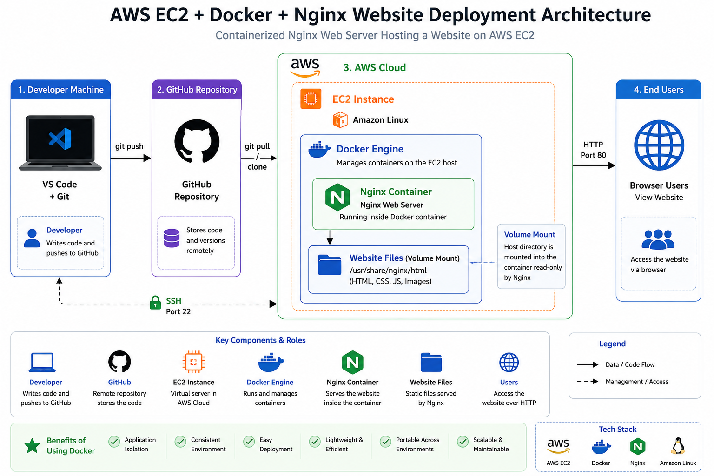

EC2 Instance

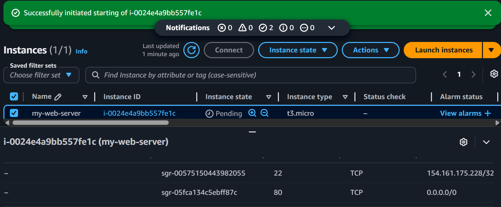

Nginx Status

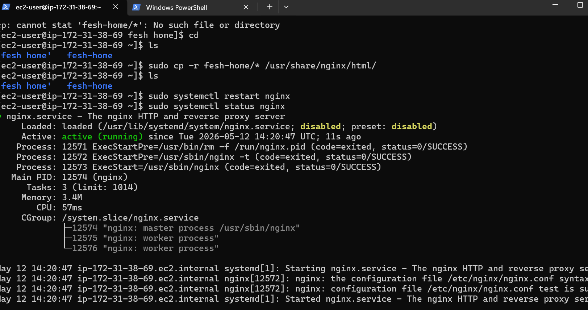

 Live Website
 
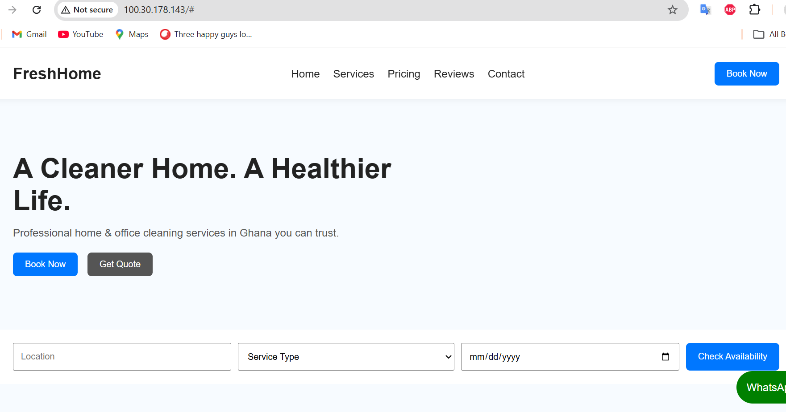

 EC2 Instance
 
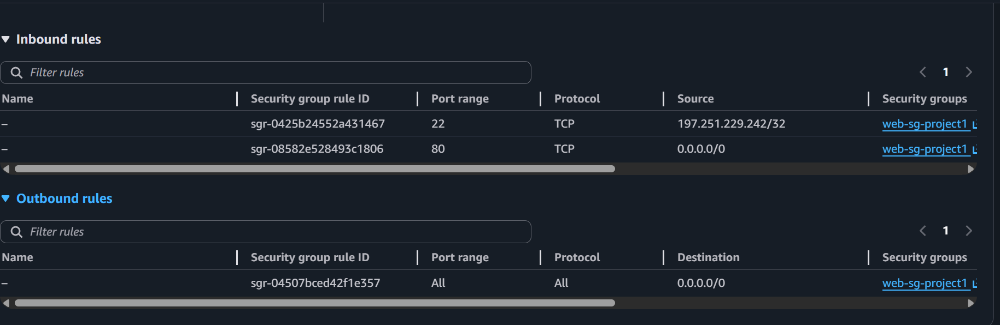

Github Repo

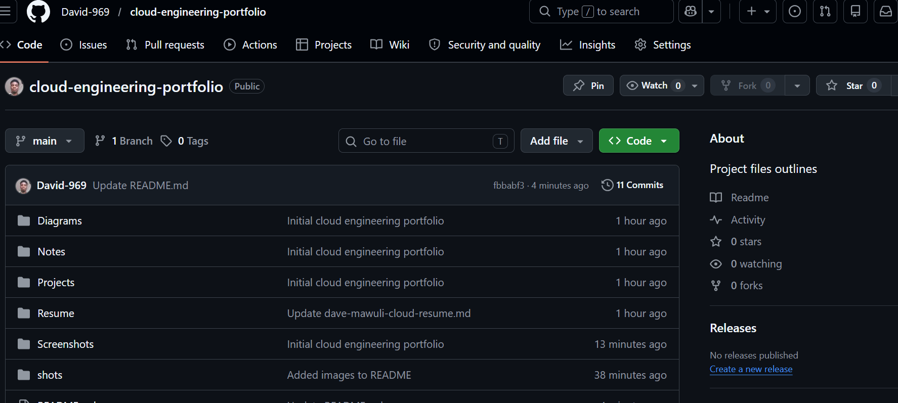

SSH Login Successful

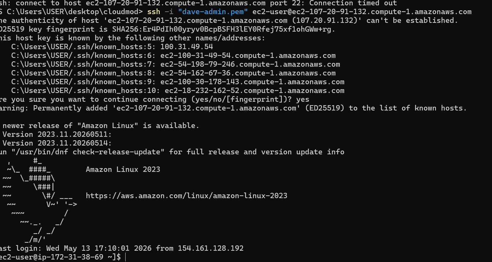

inbound traffic allowed

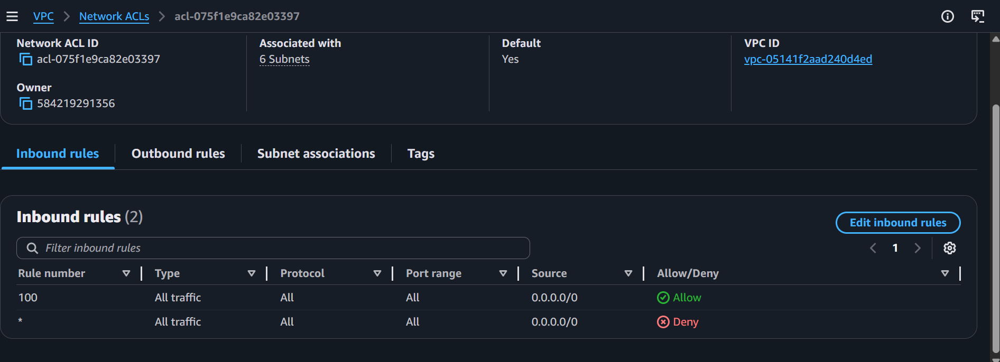
Inbound traffic rule allowed here, makes it possible for the web page to display and be reachable.

inbound traffic Denied

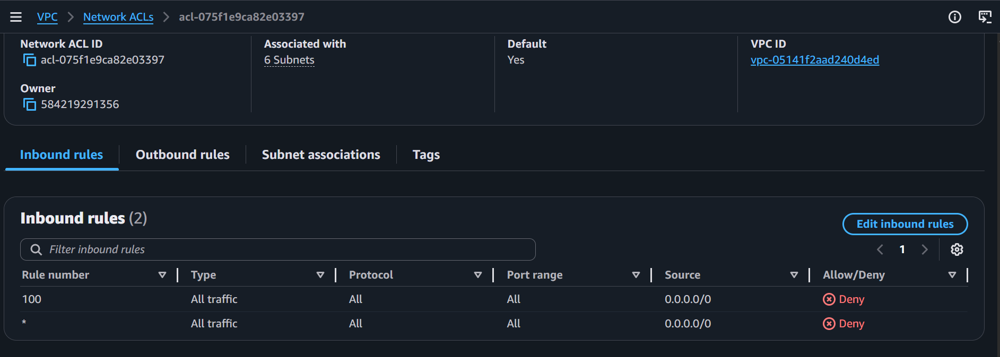
Inbound traffic rule in deny state, stops the web page from being reachable.

page live inbound allow

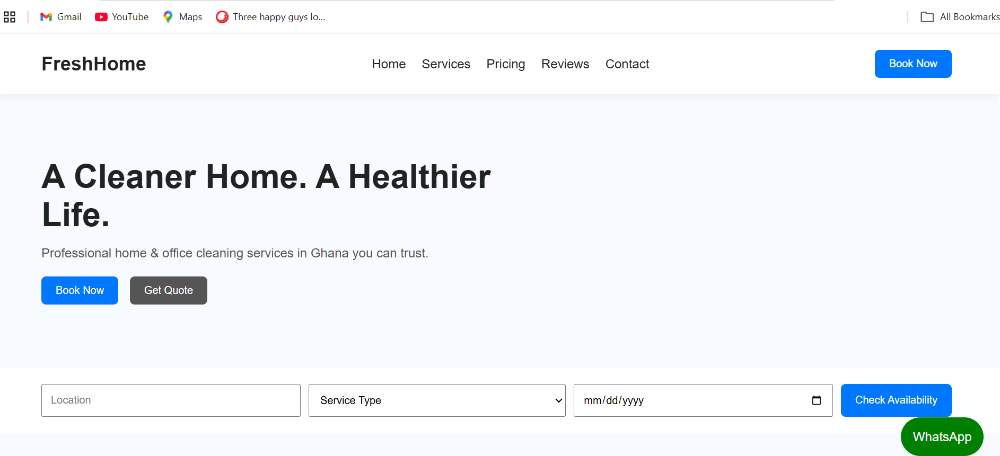
This web page is live in this image because NACL inbound rule is allowed.

page unreachable inbound deny

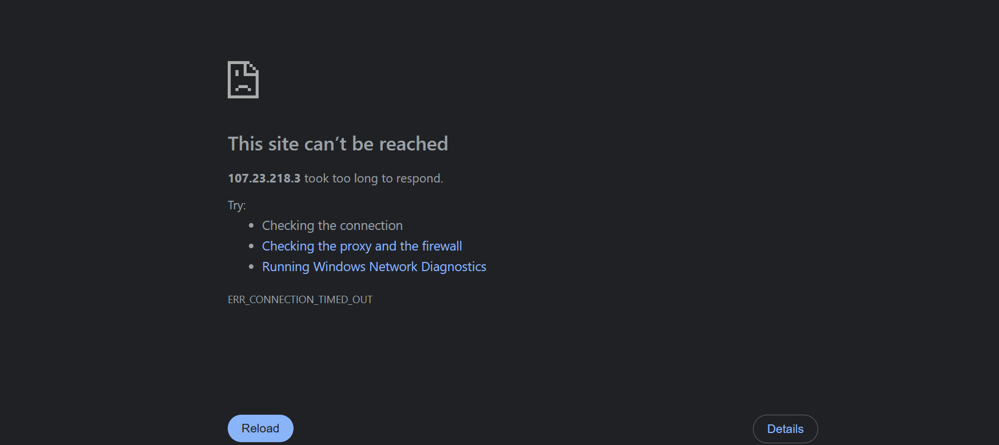
This web page is unreachable due to NACL inbound rule in a deny state.

Instance Monitoring

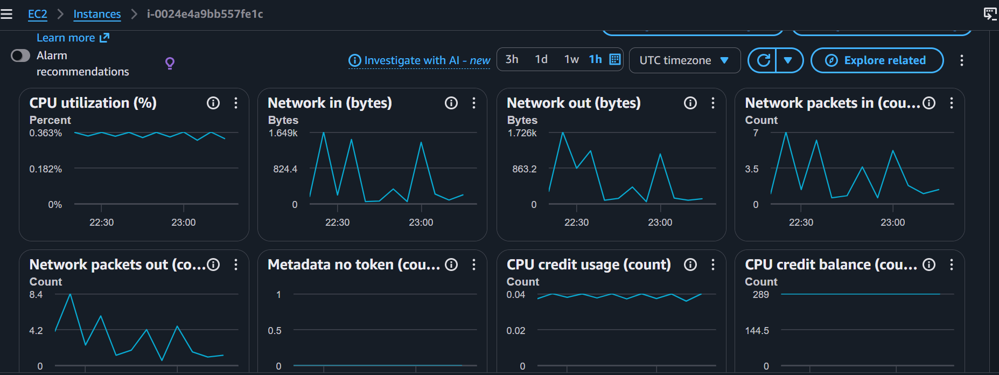

Documentation
Projects

Detailed project documentation available in:

projects/aws-ec2-nginx-project.md
Technical Notes

Operational and troubleshooting notes available in:

notes/linux-commands.md

notes/nginx-notes.md

notes/ssh-troubleshooting.md

notes/aws-security-groups.md

notes/git-github-notes.md

notes/deployment-workflow.md

AWS IAM Security & Access Control Lab

Project Overview

Built a practical AWS IAM security lab to understand identity management, access control, and least privilege principles in AWS cloud environments.

This project focused on:

1. IAM user management
2. permission enforcement
3. security best practices
4. AWS account governance
5. access troubleshooting

   
   Technologies Used
   
1. AWS IAM
2. AWS EC2
3. AWS Management Console
4. Git & GitHub

   
Key Features

1. Created multiple IAM users with different permission levels

2. Configured AWS Management Console access

3. Implemented least privilege access control

4. Tested IAM permission enforcement

5. Performed region-based troubleshooting

6. Demonstrated role separation and security boundaries

   

IAM Users Created

User	          Access Level	              Purpose
Dave-Admin	   AdministratorAccess	        Full AWS administration

Dev-User	     AmazonEC2ReadOnlyAccess	     Read-only infrastructure access

Security Concepts Demonstrated

1. Identity & Access Management (IAM)
2. Least Privilege Principle
3. Role-Based Access Control (RBAC)
3. Permission Enforcement
4. AWS Region Awareness
5. Cloud Security Fundamentals
6. Access Troubleshooting

Permission Testing

The developer account was tested against restricted EC2 actions.

Successful Actions

1. View EC2 instances
2. Inspect infrastructure resources
   
Blocked Actions

1. Launch EC2 instances
2. Modify infrastructure
3. Terminate EC2 instances

This verified correct IAM policy enforcement.

Troubleshooting Experience

Region Mismatch Issue

Problem.
EC2 instances were not visible after login.

Cause.
Incorrect AWS region selected.

Resolution.
Switched to the correct deployment region where the EC2 instance existed.

Architecture Diagram

Project Screenshots
IAM Users

Permission Enforcement

EC2 Visibility

Skills Demonstrated

1. AWS IAM Administration
2. Cloud Security Fundamentals
3. User Access Management
4. IAM Policy Assignment
5. AWS Troubleshooting
6. Infrastructure Visibility Control
7. Security Governance Concepts

